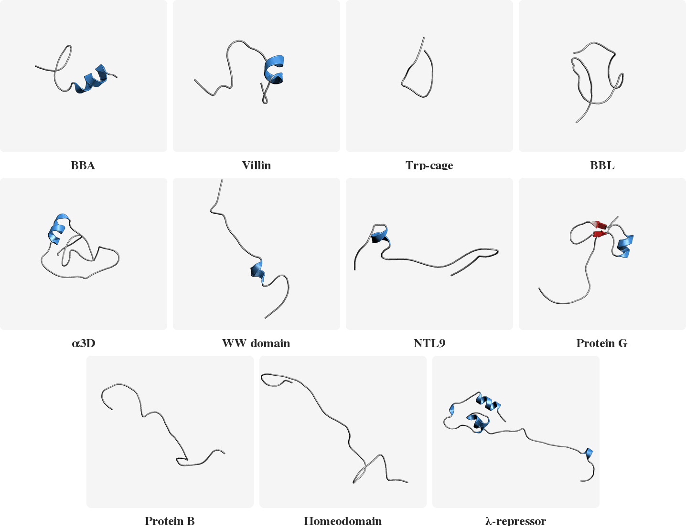
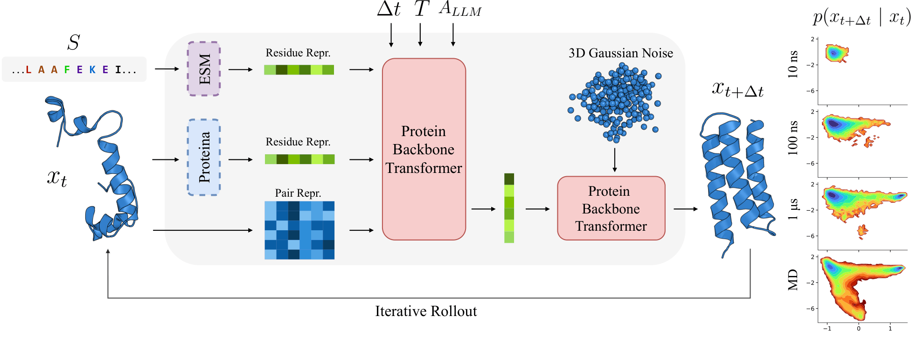

<div align="center">

<h1>PLaTITO: Protein Language Model Embeddings Improve Generalization of Implicit Transfer Operators</h1>
<br>
<a href="https://arxiv.org/abs/2602.11216">Paper</a> &nbsp;|&nbsp; <a href="https://panosantoniadis.github.io/platito/">Project Page</a> &nbsp;|&nbsp; <a href="https://huggingface.co/spaces/pantoniadis/platito">Demo</a> &nbsp;|&nbsp; <a href="https://huggingface.co/pantoniadis/platito">Checkpoints</a>
<br><br>
<a href="https://panosantoniadis.github.io/">Panagiotis Antoniadis</a> &nbsp;·&nbsp;
<a href="https://www.chalmers.se/en/persons/pavesi/">Beatrice Pavesi</a> &nbsp;·&nbsp;
<a href="https://www.chalmers.se/en/persons/simonols/">Simon Olsson</a><sup>*</sup>  &nbsp;·&nbsp;
<a href="https://olewinther.github.io/">Ole Winther</a><sup>*</sup>
<br>
<br>
<sup>*</sup>Equal contribution, ordered alphabetically.
</div>

<br><br>

<div align="center">
  
  <br>
  <em>PLaTITO reproduces folding transition kinetics in unseen settings.</em>
</div>

## Table of Contents

- [Abstract](#abstract)
- [Installation](#installation)
- [Available Models](#available-models)
- [Quick Start Notebook](#quick-start-notebook)
- [Extract ESM C Embeddings](#extract-esm-c-embeddings)
- [Generate Trajectories](#generate-trajectories)
- [Reproduce Paper Results](#reproduce-paper-results)
- [Training](#training)
- [Get in Touch](#get-in-touch)
- [Citation](#citation)

---

## Abstract

<div align="center">
  
</div>

<br>

Molecular dynamics (MD) is a central computational tool in physics, chemistry, and biology, enabling quantitative prediction of experimental observables as expectations over high-dimensional molecular distributions such as Boltzmann distributions and transition densities. However, conventional MD is fundamentally limited by the high computational cost required to generate independent samples. Generative molecular dynamics (GenMD) has recently emerged as an alternative, learning surrogates of molecular distributions either from data or through interaction with energy models. While these methods enable efficient sampling, their transferability across molecular systems is often limited. In this work, we show that incorporating auxiliary sources of information can improve the data efficiency and generalization of transferable implicit transfer operators (TITO) for molecular dynamics. We find that coarse-grained TITO models are substantially more data-efficient than Boltzmann Emulators, and that incorporating protein language model (pLM) embeddings further improves out-of-distribution generalization. Our approach, PLaTITO, achieves state-of-the-art performance on equilibrium sampling benchmarks for out-of-distribution protein systems, including fast-folding proteins. We further study the impact of additional conditioning signals — such as structural embeddings, temperature, and large-language-model-derived embeddings — on model performance.


---

## Installation

Clone the repository:
```bash
git clone https://github.com/PanosAntoniadis/platito.git
cd platito
```

Create and activate a virtual environment using [mamba](https://mamba.readthedocs.io) or [conda](https://docs.conda.io):
```bash
mamba create -n platito python=3.11 -y
mamba activate platito
```

Install all necessary dependencies:

**GPU (recommended)** — adjust the index URL for your CUDA version ([PyTorch install guide](https://pytorch.org/get-started/locally/)):
```bash
pip install -e ".[cuda]" --extra-index-url https://download.pytorch.org/whl/cu126
```

**CPU only:**
```bash
pip install -e .
```

---

## Available Models

Pre-trained checkpoints are available on HuggingFace at [`pantoniadis/platito`](https://huggingface.co/pantoniadis/platito):

| Model | Checkpoint | ESM backbone | MAE ↓ | RMSE ↓ | Coverage ↑ |
|-------|-----------|--------------|--------|--------|------------|
| TITO-3M     | `tito_3M.ckpt`     | —         | 1.068±0.272 | 1.382±0.302 | 0.590±0.111 |
| PLaTITO-3M  | `platito_3M.ckpt`  | ESMC 300M | 0.949±0.269 | 1.228±0.328 | 0.651±0.151 |
| PLaTITO-19M | `platito_19M.ckpt` | ESMC 6B   | 0.824±0.170 | 1.099±0.212 | 0.666±0.136 |
| PLaTITO-36M | `platito_36M.ckpt` | ESMC 6B   | 0.811±0.213 | 1.066±0.252 | 0.664±0.111 |


---

## Quick Start Notebook

The easiest way to try PLaTITO is the end-to-end notebook [`notebooks/run_platito_simulation.ipynb`](notebooks/run_platito_simulation.ipynb). It covers the full pipeline in one place:

1. Downloads a structure from the AlphaFold Database or RCSB PDB.
2. Extracts ESMC sequence embeddings via the EvolutionaryScale Forge API.
3. Downloads the PLaTITO checkpoint from HuggingFace and generates a trajectory.
4. Plots trajectory analysis, saves the trajectory as PDB/DCD and starts an interactive visualization.

See the [Installation](#installation) section for environment setup.

---

## Extract ESM C Embeddings

To run inference or training, you need to first extract embeddings from pretrained [ESM Cambrian (ESMC)](https://github.com/evolutionaryscale/esm) models for each sequence. `esmc-300m-2024-12` is needed for PLaTITO-3M and `esmc-6b-2024-12` for PLaTITO-19M and PLaTITO-36M. Both are accessed via the [EvolutionaryScale Forge API](https://forge.evolutionaryscale.ai), which requires an API token.

| Model | Forge model name | Embedding dim |
|-------|-----------------|---------------|
| ESMC 300M | `esmc-300m-2024-12` | 960 |
| ESMC 6B   | `esmc-6b-2024-12`  | 2560 |

A ready-to-run notebook for extracting embeddings for the fast-folding proteins used in the paper is available at [`notebooks/extract_sequence_embeddings.ipynb`](notebooks/extract_sequence_embeddings.ipynb).

For any other protein, the following snippet can be used as a starting point:

**ESMC 300M**:
```python
import torch
from esm.sdk.forge import ESM3ForgeInferenceClient
from esm.sdk.api import ESMProtein, LogitsConfig

client = ESM3ForgeInferenceClient(
    model="esmc-300m-2024-12",
    url="https://forge.evolutionaryscale.ai",
    token="<your forge token>",
)

sequence = "ACDEFGHIKLMNPQRSTVWY"  # protein sequence
protein = ESMProtein(sequence=sequence)
protein_tensor = client.encode(protein)
logits_output = client.logits(
    protein_tensor, LogitsConfig(sequence=True, return_hidden_states=True)
)

# Use layer 20; strip BOS/EOS tokens → shape [L, 960]
embeddings = logits_output.hidden_states.squeeze(1)[20][1:-1, :].cpu()
torch.save(embeddings, "seq_emb.pt")
```

**ESMC 6B**:
```python
import torch
from esm.sdk.forge import ESM3ForgeInferenceClient
from esm.sdk.api import ESMProtein, LogitsConfig

client = ESM3ForgeInferenceClient(
    model="esmc-6b-2024-12",
    url="https://forge.evolutionaryscale.ai",
    token="<your forge token>",
)

sequence = "ACDEFGHIKLMNPQRSTVWY"  # protein sequence
protein = ESMProtein(sequence=sequence)
protein_tensor = client.encode(protein)
logits_output = client.logits(
    protein_tensor, LogitsConfig(sequence=True, return_embeddings=True)
)

# Strip BOS/EOS tokens → shape [L, 2560]
embeddings = logits_output.embeddings[0, 1:-1, :].cpu()
torch.save(embeddings, "seq_emb.pt")
```

---

## Generate Trajectories

To generate trajectories for any protein, PLaTITO takes as input a starting structure in PDB format and follows Algorithm 3 of the paper. You can use `scripts/sample.py` that loads a checkpoint from a local file or automatically downloads it from HuggingFace. Then, it initializes a number of parallel trajectories from the starting structure and iteratively samples from the learned transition density to generate a set of long trajectories.

Some key parameters (see [`configs/sample.yaml`](configs/sample.yaml)):

- `pdb_path` : Path to the starting structure in PDB format
- `seq_emb_path` : Path to the pre-computed pLM embedding `.pt` file (shape `[L, D]`)
- `number_of_trajectories` : Number of parallel trajectories to generate (default: `1000`)
- `step` : Physical lag time per step in ns (default: `1`)
- `number_of_steps` : Rollout steps per trajectory where total time = `step × number_of_steps` ns (default: `1000`)
- `temperature` : Simulation temperature in K (default: `300`)
- `method` : ODE solver method (default: `euler`)
- `integrator_steps` : Number of ODE steps per sample (default: `50`)
- `save_intermediate_steps` : If `True`, save all frames along the trajectory; if `False`, save only the final frame (default: `True`)
- `gpu_device` : GPU index to use, or `null` for CPU (default: `0`)

Generated coordinates are saved as `generated_coords.pt` (shape `[N_traj, N_steps+1, L, 3]` in nm when `save_intermediate_steps=True`, or `[N_traj, L, 3]` when `False`) in `paths.output_dir`. By default, this path resolves to a directory with a timestamp under `paths.log_dir` (e.g. `logs/sample_platito/runs/2026-04-18_10-30-00/`), so consecutive runs never overwrite each other. Override `paths.output_dir=./my/path` to use a fixed directory instead.

> [!TIP]
> To run on CPU, add `gpu_device=null` to any of the commands below.

### HuggingFace Hub (recommended)

```bash
python scripts/sample.py \
    hf_repo_id=pantoniadis/platito \
    hf_filename=platito_3M.ckpt \
    pdb_path=/path/to/start.pdb \
    seq_emb_path=/path/to/seq_emb.pt \
    paths.output_dir=./outputs/my_protein \
    gpu_device=0
```

### Local checkpoint

```bash
python scripts/sample.py \
    checkpoint_path=/path/to/platito.ckpt \
    pdb_path=/path/to/start.pdb \
    seq_emb_path=/path/to/seq_emb.pt \
    paths.output_dir=./outputs/my_protein \
    gpu_device=0
```


### Example: Generate 1 μs trajectory of BBA

To reproduce the BBA equilibrium sampling experiment from the paper, you need to generate 1000 parallel trajectories of 1 μs total time (1000 steps × 1 ns lag) at 325 K as follows:

```bash
python scripts/sample.py \
    hf_repo_id=pantoniadis/platito \
    hf_filename=platito_19M.ckpt \
    pdb_path=data/fast_folders/initial_structures/bba/unfolded.pdb \
    seq_emb_path=embeddings/esmc_6b/bba.pt \
    number_of_trajectories=1000 \
    number_of_steps=1000 \
    step=1 \
    temperature=325 \
    paths.output_dir=./results/platito_19M/bba \
    gpu_device=0
```

Initial folded and unfolded structures for all fast-folding proteins used in the paper are provided in [`data/fast_folders/initial_structures/`](data/fast_folders/initial_structures/), with one subfolder per protein containing `folded.pdb` and `unfolded.pdb`.

> [!NOTE]
> The full MD trajectories of the fast-folding proteins ([Lindorff-Larsen et al., Science 2011](https://www.science.org/doi/10.1126/science.1208351)) are proprietary and cannot be redistributed. Please contact the authors to request access for research purposes.


---

## Reproduce Paper Results

To reproduce the results for the equilibrium sampling benchmark on the fast-folding proteins:

1. **Estimate TICA models**: Use [`notebooks/estimate_tica.ipynb`](notebooks/estimate_tica.ipynb) to estimate a TICA model for each protein from its MD reference trajectory.
2. **Generate trajectories**: Run `scripts/sample.py` for each protein as described in [Generate Trajectories](#generate-trajectories).
3. **Compute metrics**: Follow the procedure in [`notebooks/equilibrium_sampling.ipynb`](notebooks/equilibrium_sampling.ipynb) to project both MD and PLaTITO trajectories into the slowest TICA components, visualize free energy surfaces and compute MAE, RMSE, and Coverage.

---

## Training

### Data

Download the [mdCATH dataset](https://huggingface.co/datasets/compsciencelab/mdCATH) from HuggingFace:

```python
from huggingface_hub import snapshot_download

snapshot_download(
    repo_id="compsciencelab/mdCATH",
    repo_type="dataset",
    local_dir="/path/to/data/mdCATH",
    resume_download=True,
)
```

Then extract $C_{\alpha}$ coordinates of each residue for each protein domain:

```bash
python scripts/prepare_mdcath.py /path/to/data/mdCATH/data
```

This script replaces the all-atom `coords` dataset with a `ca_coords` dataset of shape `[n_frames, L, 3]` to enable faster data loading.

Then precompute ESMC embeddings for each protein domain (see [Extract ESM C Embeddings](#extract-esm-c-embeddings)) and save them as a single `.pt` file containing a dictionary mapping each domain name to its embedding tensor of shape `[L, D]`:

```python
import torch

embeddings = {
    "12asA00": tensor_1,  # shape [L1, D]
    "153lA00": tensor_2,  # shape [L2, D]
    # ...
}
torch.save(embeddings, "/path/to/data/mdCATH/embeddings/esmc_6b.pt")
```

The expected directory layout is:
```
mdCATH/
├── data/
│   ├── mdcath_dataset_<domain>.h5
│   └── ...
└── embeddings/
    └── esmc_6b.pt
```

Set `paths.project_data_dir` to the directory containing the `mdCATH/` folder.

### Run training

```bash
python scripts/train.py \
    paths.project_data_dir=/path/to/data
```

Multi-GPU training (DDP):

```bash
python scripts/train.py \
    trainer=ddp \
    trainer.devices=8 \
    paths.project_data_dir=/path/to/data
```

Key parameters (see [`configs/train.yaml`](configs/train.yaml)):

- `paths.project_data_dir` : Root directory containing the `mdCATH/` folder
- `paths.output_dir` : Directory where checkpoints and logs are saved
- `data.seq_emb_name` : Name of the embeddings file under `mdCATH/embeddings/` (default: `esmc_6b`)
- `trainer.max_epochs` : Number of training epochs (default: `1000`)
- `trainer.devices` : Number of GPUs to use (default: `1`)
- `logger` : Set to `null` to disable Weights & Biases logging (default: `wandb`)
- `logger.project` : W&B project name (default: `platito`)
- `logger.entity` : W&B team or username (default: unset)
- `logger.name` : W&B run name (default: unset)

Training logs to [Weights & Biases](https://wandb.ai) by default. Set `logger=null` to disable it, or configure your W&B entity with `logger.entity=<your_entity>`.

The default configs in `configs/model/nn/` correspond to **PLaTITO-19M** (`token_dim=256`, `nlayers=6`, `sequence_emb_dim=2560` for ESMC 6B).

---


## Get in Touch

If you have any questions not covered here, please open a [GitHub issue](../../issues) or contact us via the [paper](https://arxiv.org/abs/2602.11216).

---

## Citation

If you use our code or models, please cite:

```bibtex
@article{antoniadis2026platito,
  title={Protein Language Model Embeddings Improve Generalization of Implicit Transfer Operators},
  author={Antoniadis, Panagiotis and Pavesi, Beatrice and Olsson, Simon and Winther, Ole},
  journal={arXiv e-prints},
  pages={arXiv--2602},
  year={2026}
}
```
